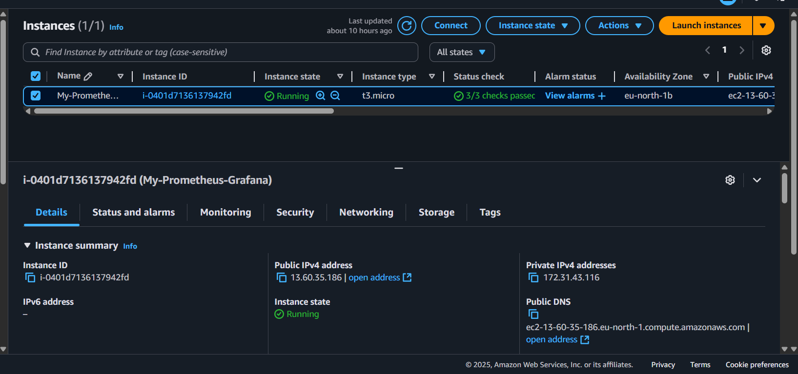
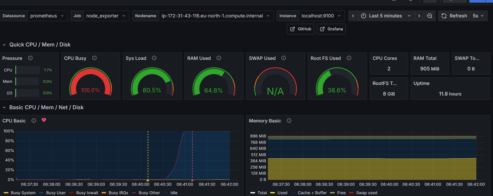

# AWS Cloud Monitoring & Observability Pipeline

This project demonstrates a complete monitoring pipeline deployed on an **AWS EC2** instance. It uses **Prometheus** for metrics, **Loki** for logs, and **Grafana** for visualization, integrated with an automated **AWS SNS** email alerting system.

##  Implementation Details

* **Cloud Infrastructure**: Deployed on an **EC2 t3.micro** instance (Instance ID: `i-0401d7136137942fd`) in the **eu-north-1** region.
* **Metric Collection**: Configured **Prometheus** to scrape hardware metrics via **Node Exporter** at `localhost:9100`.
* **Log Aggregation**: Integrated **Grafana Loki** to centralize system logs, allowing for real-time log exploration.
* **Automated Alerting**: Established a threshold-based alert system (**"CPU Basic"**) using **AWS SNS** to notify via email when system limits are reached.

---

## 📸 Proof of Implementation

### 1. AWS Infrastructure
The system is hosted on a live AWS instance with a public IPv4 address of `13.60.35.186`.

### 2. System Health & Stress Test
During a stress test, the Grafana dashboard successfully captured a **100% CPU Busy** spike, demonstrating real-time monitoring accuracy.

### 3. Centralized Logging (Loki)
Logs are aggregated and searchable directly within Grafana, facilitating rapid incident debugging.

### 4. Verified Alerting (AWS SNS)
When the CPU threshold was breached, the alert moved to a **FIRING** state, and an automated email was delivered via **AWS SNS**.

